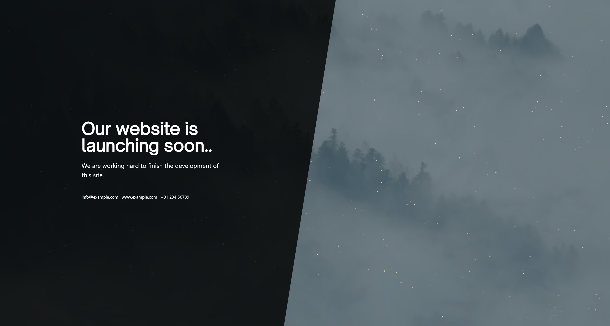

# docker-landingpage-coming-soon



## Quickstart
```yaml
version: '3'
services:
    docker_landingpage_app:
        image: ghcr.io/amacado/docker-landingpage-coming-soon:main
        ports:
            - "8080:80"
        environment:
            - TITLE="Our website is launching soon.."  
            - META_TITLE="Launching soon!"  
            - SUBTITLE="We are working hard to finish the development of this site."  
            - FOOTER="<a href='mailto:info@example.com'>info@example.com</a> | <a href='https://www.example.com'>www.example.com</a> | <a href='tel:0123456789'>+00 0123 456789</a>"  
            - OVERLAY_COLOR="rgba(0, 0, 0, 0.8)"  
            - BACKGROUND_COLOR="#455A64"  
```

```
docker run -d -p 8080:80 ghcr.io/amacado/docker-landingpage-coming-soon:main
```

## Environment
| Variable           | Description                                                       | Default                                                     |
|--------------------|-------------------------------------------------------------------|-------------------------------------------------------------|
| `TITLE`            | Main website title                                                | Our website is launching soon..                             |
| `META_TITLE`       | HTML `<title>` tag content                                        | Launching soon!                                             |
| `SUBTITLE`         | Subtitle of the website                                           | We are working hard to finish the development of this site. |
| `FOOTER`         | Small footer below subtitle                                       | `<a href='mailto:info@example.com'>info@example.com</a> | <a href='https://www.example.com'>www.example.com</a> | <a href='tel:0123456789'>+00 0123 456789</a>`  |
| `OVERLAY_COLOR`    | Background color of the overlay for displaying title and subtitle | rgba(0, 0, 0, 0.8)                                          |
| `BACKGROUND_COLOR` | Background color for the website                                  | #455A64                                                     |

## Credits
- Background Video by <a href="https://pixabay.com/users/jonathan_fahrny-3513303/">Jonathan Fahrny</a> from <a href="https://pixabay.com/">Pixabay</a>
- Start Bootstrap - Coming Soon v6.0.7 (https://startbootstrap.com/theme/coming-soon)
- Bootstrap  v5.2.3 (https://getbootstrap.com/)
- Fontsource: "Open Sauce Sans" https://fontsource.org/fonts/open-sauce-sans
